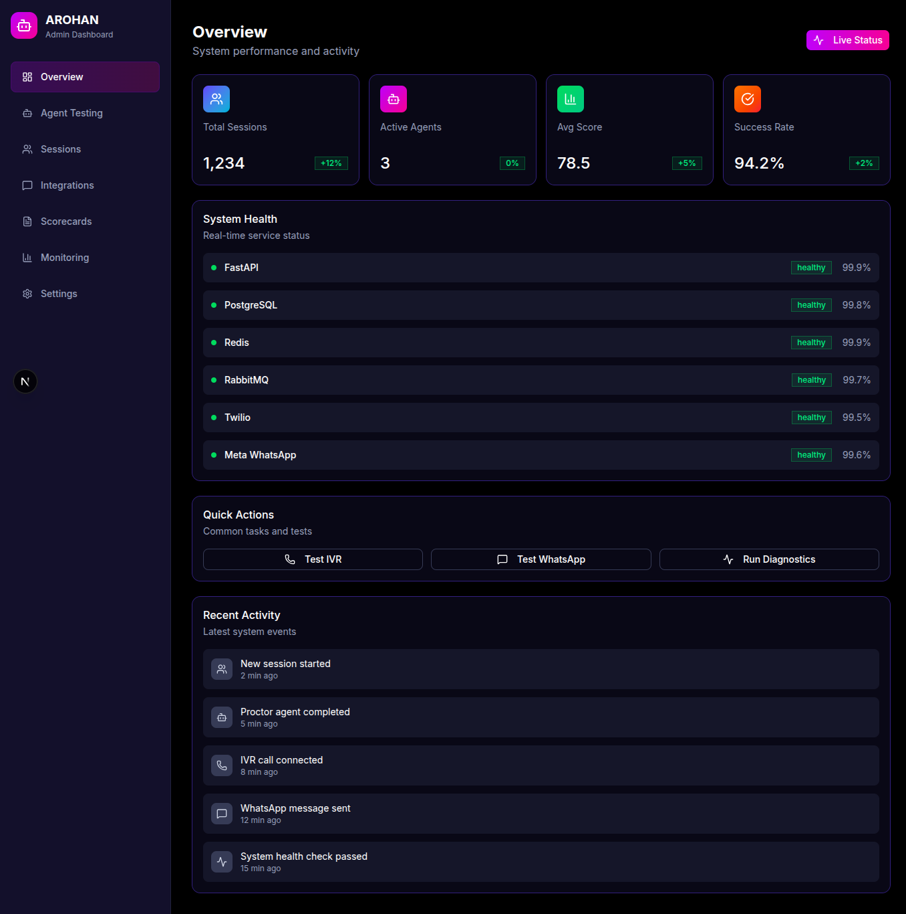
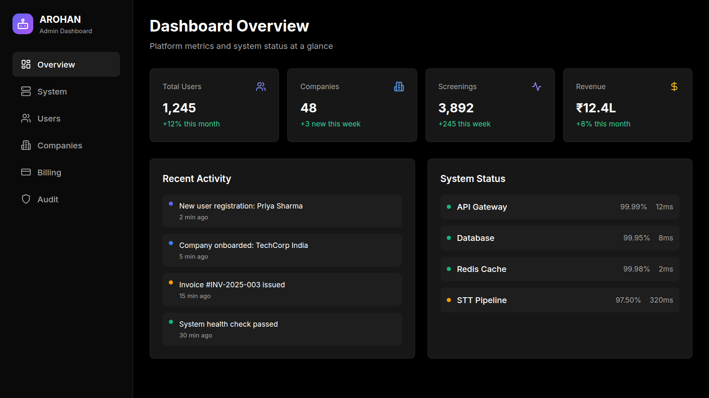
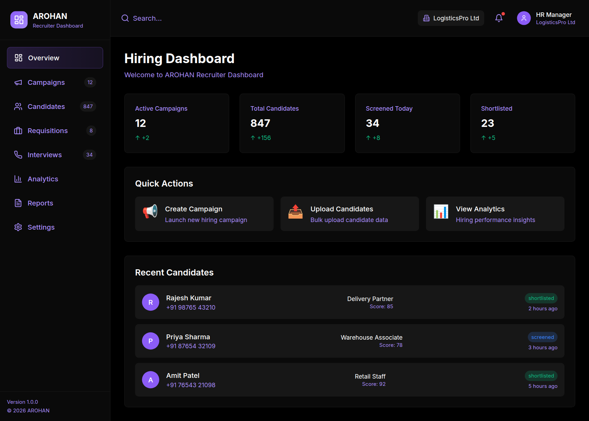
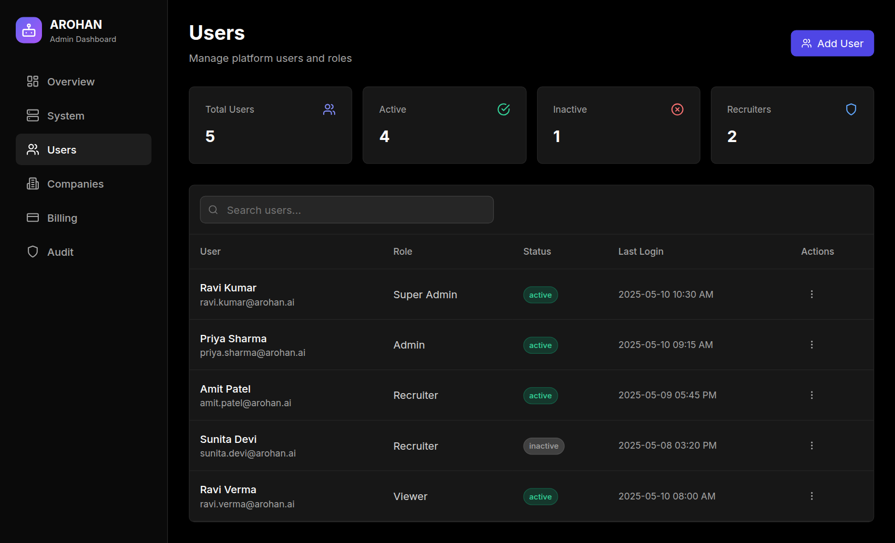
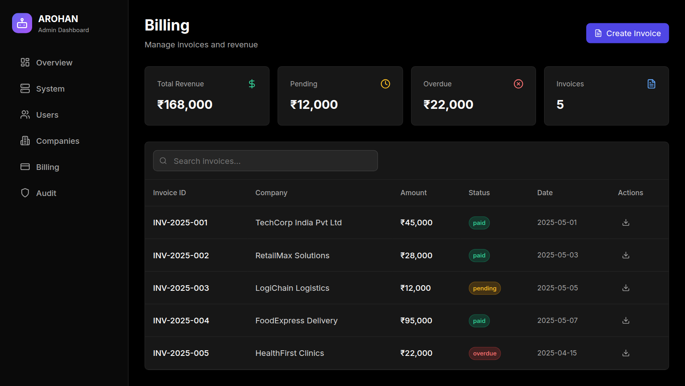
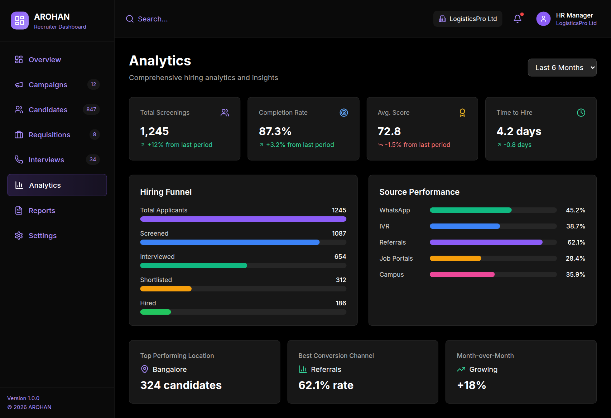
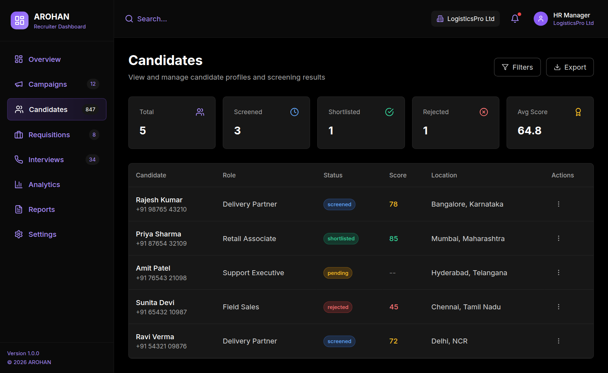
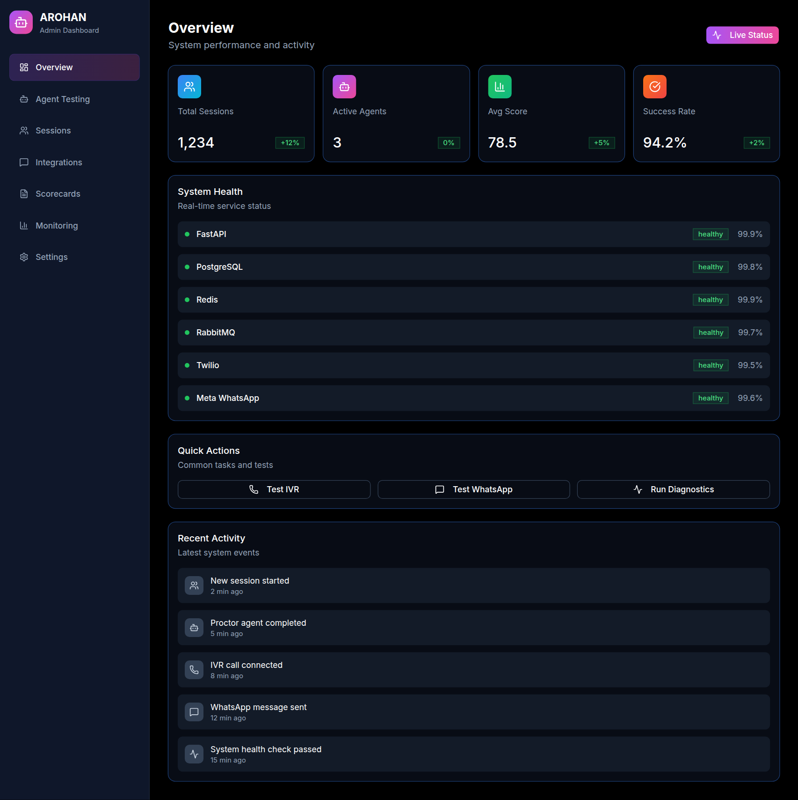
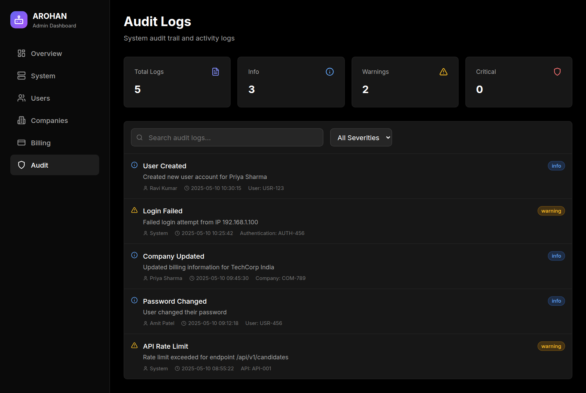

<p align="center">
  <picture>
    <source media="(prefers-color-scheme: dark)" srcset="screenshots/dashboard/arohan.png">
    
  </picture>
</p>

<h1 align="center">AROHAN — Voice-Native Mass Screening Mesh for Bharat</h1>

<p align="center">
  <a href="https://github.com/ravikumarve/Arohan"></a>
  <a href="#"></a>
  <a href="docs/PRD.md"></a>
  <a href="LICENSE"></a>
</p>

<p align="center">
  <b>No resume. No webcam. No dashboard required.</b><br>
  A candidate gives a missed call — and gets a full AI-powered voice interview in their language,<br>
  scored and matched to open roles before a recruiter opens their inbox.
</p>

<br>

---

## 💡 The Problem

India hires **12 million blue-collar workers a year**. The recruitment process was designed for knowledge workers — PDF resumes, Zoom calls, web forms. None of that works at the ground level.

| Reality | Cost |
|---------|------|
| HR spends **₹200–500** per candidate before the first interview | ₹15–20 with AROHAN |
| Tier 2/3 candidates have shared phones, 3G, no webcam | Just a missed call |
| Resume screening for roles where no one has a resume | Resume-less triage |
| Webcam interviews where bandwidth is the bottleneck | Voice-native IVR |
| Drop-off calls with no recovery | WhatsApp resume in 60s |

**AROHAN cuts per-screening cost by ~90%.** At 1,000 screenings/month, that's **₹1.85L savings per client**.

---

## 🎙️ How It Works

```
📞 Missed Call → 🧠 Proctor (Interview) → 📊 Assessor (Score) → 🎯 Matchmaker (Dispatch)
                           ↕                              ↕
                    🔄 Drop-off Recovery           🗺️ Geo-Aware Routing
```

| Agent | Role | Tools |
|-------|------|-------|
| **Proctor** | Conducts a fluid 5-min voice interview, adapts difficulty per answer, handles drop-offs | `TwilioVoiceGen` · `DynamicScripting` · `SessionStateManager` |
| **Assessor** | Scores confidence, keyword accuracy, situational judgment → structured 1–100 scorecard | `SentimentAnalyzer` · `SkillMatrix` · `PineconeVectorStore` |
| **Matchmaker** | Matches scorecard to open requisitions within geo-radius, fires ATS webhook + WhatsApp notification | `GeoSpatialQuery` · `ATS-Webhook` · `WhatsAppNotifier` |

### 🎬 STT Pipeline

```
Audio In → 🧹 RNNoise (Noise Suppression) → 🌐 Language Detection → 📖 Domain Vocabulary Injection → ✨ Transcript Normalization
```

Handles traffic, construction sites, crowded markets — pre-processes every file before a single token is transcribed. Supports **22 Indian languages** via Bhashini + Whisper fallback.

---

## 🖥️ Dashboard Architecture

Three dashboards, one design system — each serving a distinct stakeholder. All share components via `@arohan/shared`.

<br>

<table>
  <tr>
    <td width="33%" align="center">
      <br>
      <strong>⚙️ Console</strong><br>
      <sub>Internal Ops · Port 3000</sub>
    </td>
    <td width="33%" align="center">
      <br>
      <strong>🛡️ Admin</strong><br>
      <sub>Platform Admin · Port 3001</sub>
    </td>
    <td width="33%" align="center">
      <br>
      <strong>💼 Recruiter</strong><br>
      <sub>Employer Portal · Port 3002</sub>
    </td>
  </tr>
</table>

### Console — Internal Operations Center
AI agent testing, integration management, system monitoring, scorecard verification, API credential management. Used by ops/QA teams.

### Admin — Platform Administration
Users, companies, billing, audit logs, system health. Used by customer success teams.

### Recruiter — Employer Hiring Workflows
Campaigns, candidates, requisitions, interviews, analytics, reports, settings. Used by hiring teams.

### 🔧 Shared Component Library (`@arohan/shared`)
All three dashboards are powered by a shared library at `shared/` providing:

- **Types** — `User`, `Company`, `Candidate`, `Campaign`, `Permission`, `Scorecard` enums
- **UI Components** — Button, Card, Input, Badge, Table, Modal, Toast, Select, LoadingSpinner, EmptyState
- **API Hooks** — `useUsers`, `useCampaigns`, `useCandidates`, `useBilling`, `useAnalytics`, etc.
- **Auth** — Zustand auth store with role/permission checking and data isolation
- **Utilities** — Formatting, validation, `cn()` class merging, date helpers

### 🎨 Theme System — Unified Pure Black

| Dashboard | Accent | Feel |
|-----------|--------|------|
| **Console** | Purple `#a855f7` | Dev tools, internal |
| **Admin** | Indigo `#6366f1` | Platform ops, professional |
| **Recruiter** | Violet + Pink `#8B5CF6` + `#EC4899` | Modern, customer-facing |

Background: pure black (`#000000`) · Card surfaces: `bg-neutral-900` · Text: white / `neutral-400` · WCAG 2.1 AA compliant

<details>
<summary>🖼️ More Screenshots</summary>

<table>
  <tr>
    <td><strong>Admin — Users</strong><br></td>
    <td><strong>Admin — Billing</strong><br></td>
  </tr>
  <tr>
    <td><strong>Recruiter — Analytics</strong><br></td>
    <td><strong>Recruiter — Candidates</strong><br></td>
  </tr>
  <tr>
    <td><strong>Console — Monitoring</strong><br></td>
    <td><strong>Admin — Audit</strong><br></td>
  </tr>
</table>

</details>

---

## 🛠️ Technology Stack

| Layer | Technology | Why |
|-------|-------------|-----|
| **Agent Orchestration** | LangGraph | DAG-based stateful flows with checkpointing for drop-off recovery |
| **API Framework** | FastAPI · Python 3.12 | Async throughout — concurrent audio webhook ingestion |
| **Telephony** | Twilio Programmable Voice | Missed call detection + IVR callback |
| **Messaging** | Meta WhatsApp Cloud API | 500M+ Indian users — zero install friction |
| **STT** | Bhashini + Whisper | 22 Indian languages + English fallback |
| **Task Queue** | RabbitMQ + Celery | Dead-letter queues for bursty mass-hire drives |
| **Session State** | Redis | LangGraph checkpoint storage for drop-off recovery |
| **Database** | PostgreSQL 15 | ACID-compliant for financial-grade data |
| **Vector Store** | Pinecone | Candidate response → trait embedding similarity |
| **Dashboards** | Next.js 16 + Tailwind CSS | Three-dashboard architecture, shared component lib |
| **Noise Suppression** | RNNoise / WebRTC VAD | Pre-STT field noise removal |

---

## 💰 Monetization

**Pay-per-screening. No seat licenses.**

| Tier | Price | Volume | Features |
|------|-------|--------|----------|
| **Startup** | ₹18/scrn | ≤ 500/mo | IVR + WhatsApp, 3 role templates, Basic dashboard |
| **Growth** | ₹14/scrn | 500–5,000/mo | Custom question banks, ATS webhook, Priority support |
| **Enterprise** | ₹10/scrn | 5,000+/mo | Geo-routing, White-label dashboard, SLA guarantee |
| **On-Premise** | License | Unlimited | Air-gapped deploy, Full source access, Setup support |

Traditional recruitment costs ₹200–500 per screening. AROHAN brings it to **₹15–20** — ~85% gross margin at scale.

---

## 📁 Project Structure

```
├── src/            # FastAPI backend (agents, NLP, API, models, tasks)
├── console/        # Internal ops dashboard (Next.js 16 · port 3000)
├── admin/          # Platform admin panel (Next.js 14 · port 3001)
├── recruiter/      # Employer hiring portal (Next.js 16 · port 3002)
├── frontend/       # Marketing landing page (Next.js 16 · port 3003)
├── shared/         # @arohan/shared — types, UI kit, hooks, auth, utils
├── tests/          # Backend test suite
├── docs/           # PRD, ADR, API spec, compliance, pricing model
├── monitoring/     # Prometheus, Grafana, Alertmanager configs
├── config/         # Environment templates
└── screenshots/    # Dashboard previews
```

---

## 📄 License

Apache 2.0 — see [LICENSE](LICENSE)

<br>
<p align="center">Built in Bharat · For Bharat 🇮🇳</p>
